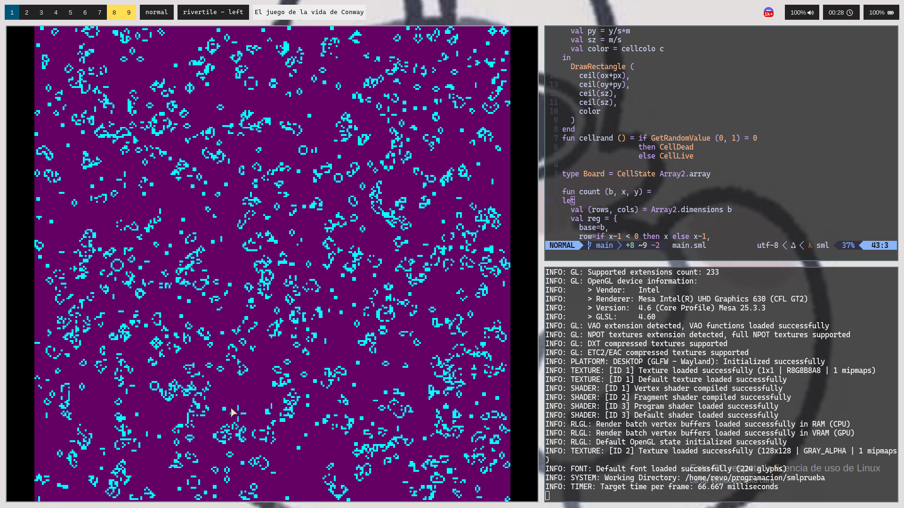

taken from reddit 
https://gitlab.com/nemurak_steloj/standardml-gameoflife

Juego de la vida (Game of life) en Standard ML (PolyML) con Raylib.

# Dependencias

- PolyML
- Raylib

# Como ejecutar

Primero:

`poly --use repl.sml`

Y dentro del REPL de PolyML

`> main();`

> NOTA: Por defecto se busca la libreria raylib en `/usr/lib64/libraylib.so`
por lo que en caso de estar en otra localización modificar la ruta dentro del
archivo `raylib.sml`. Teoricamente deberia funcionar en windows si se descarga
la libreria y se modifica la ruta para que apunte donde se encuentra la libreria

translates to if you build raylib from source on my machine the library goes to `/usr/local/lib/libraylib.so` , change line in raylib.sml line 5 to load library correctly 

